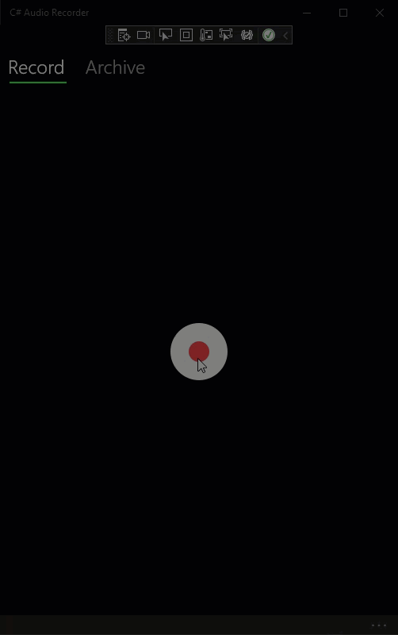
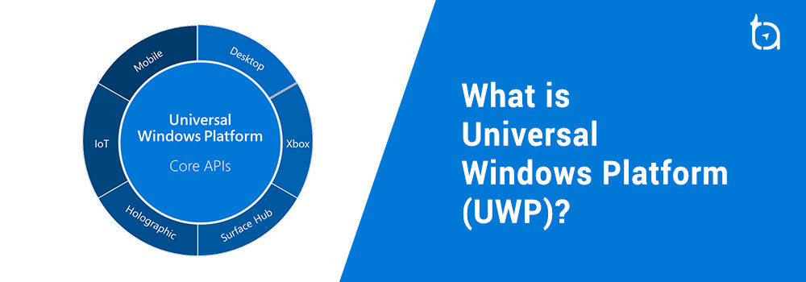

# UWP C# Audio Recorder Application

        
        

    
    
    
     
    
    

-------

A simple **Audio Recorder** and Playback application written in `C#` using **Visual Studio** and the **Universal Windows Platform (UWP)** framework. 
- Under the **Record** tab:
    - Record audio
- Under the **Archive** tab:
    - Playback audio
    - Delete audio
    - Export audio to a `mp3` file

    
     
    <i>Application Preview.</i>

## Table of Contents
- [What is the Universal Windows Platform (UWP)?](#what-is-the-universal-windows-platform-uwp)
- [Getting Started](#getting-started)
- [Requirements](#requirements)
- [Usage](#usage)
- [References](#references)
- [License](#license)
- [Credit](#credit)

## What is the Universal Windows Platform (UWP)?
The **Universal Windows Platform (UWP)** is a platform-homogeneous application architecture created by Microsoft and first introduced in Windows 10. The purpose of this software platform is to help develop Metro-style apps that run on both Windows 10 and Windows 10 Mobile without the need to be re-written for each. It supports Windows app development using C++, C#, VB.NET, and XAML. Developers can build UWP apps that exclusively use UWP controls and APIs, or they can use UWP controls and APIs in desktop apps that are built using one of the supported Windows app frameworks.

    
     
    <i>What is the Universal Windows Platform (UWP)?</i>

## Requirements
- Visual Studio 2022
- Windows 10 SDK (10.0.19041.0)

## Getting Started
1. Clone the repository
2. Open the project in Visual Studio
3. Build the project
4. Run the project

## Usage
- Click the `Record` button to start recording audio
- Click the `Stop` button to stop recording audio
- Click the `Play` button to play the recorded audio
- Click the `Delete` button to delete the recorded audio
- Click the `Export` button to export the recorded audio to a `mp3` file

## References
- [C# Documentation](https://docs.microsoft.com/en-us/dotnet/csharp/)
- [Universal Windows Platform (UWP) documentation](https://docs.microsoft.com/en-us/windows/uwp/)
- [Visual Studio Documentation](https://docs.microsoft.com/en-us/visualstudio/)

## License
- This project is released under the terms of the **MIT License**, which permits use, modification, and distribution of the code, subject to the conditions outlined in the license.
- The [MIT License](https://choosealicense.com/licenses/mit/) provides certain freedoms while preserving rights of attribution to the original creators.
- For more details, see the [LICENSE](LICENSE) file in this repository. in this repository.

## Credit
**Author:** Scott Grivner  
**Email:** scott.grivner@gmail.com  
**Website:** [scottgrivner.dev](https://www.scottgrivner.dev)  
**Reference:** [Main Branch](https://github.com/scottgriv/csharp-audio_recorder)
